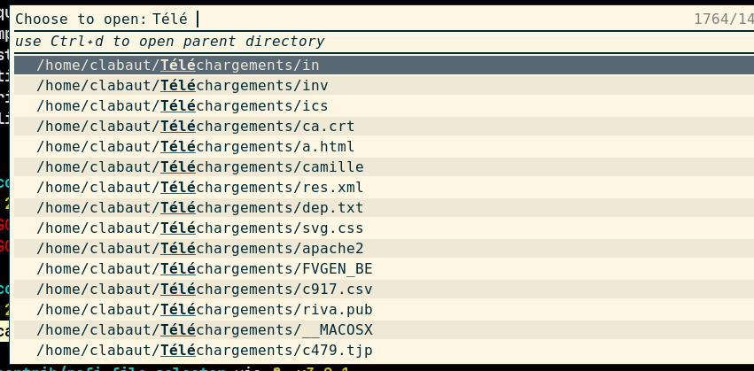
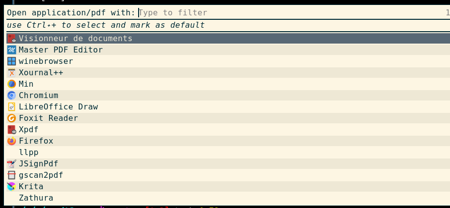

# Rofi file selector

This is a set of script and python program that allow to quickly find and open
a file for which you know part of the name.





## Features

- search in whole `$HOME` or in several set of directories.
- choose the application use to open the file
- Allow to set the default application for this file type (`Ctrl+`)
- Cache the file list in order to allow for fast searching (except for the
  first time).

## Installation

Install the `PyGObject` package as described in the
[documentation](https://pygobject.readthedocs.io/en/latest/getting_started.html).

Clone this repository.

## Usage

Simply launch the script `rofi-file-selector.sh`.

## Configuration

The configuration is defined with the help of several bash arrays in the
`config.sh` file. An example is given in the `config.sh.example` file:
```bash
#!/bin/bash
# MENU is the list of items that will be presented to the user
# Usefull when you have huge home directory which takes
# to long to scan and or when you want to be able to limit the search to some
# directories
# Defaults to :
# MENU=( home )
MENU=(personal work admin)

# For each item `X` defined in the MENU array, you have to define in `d_X` an
# array of directories which will be search for file with `fd`.
# You may also define `f_X` which is an array of file which will be added to
# the rofi menu.
#
# The array items are subject to shell expansion.

d_personal=(~/Downloads ~/Documents ~/Models )
d_work=(~/work/projects/web-* ~/work/accounting/ ~/Downloads ~/Models)
f_work=(~/work/{til.md,account.ledger,time.ledger,log.md})
d_admin=(~/admin ~/Downloads /var/log/)
```
